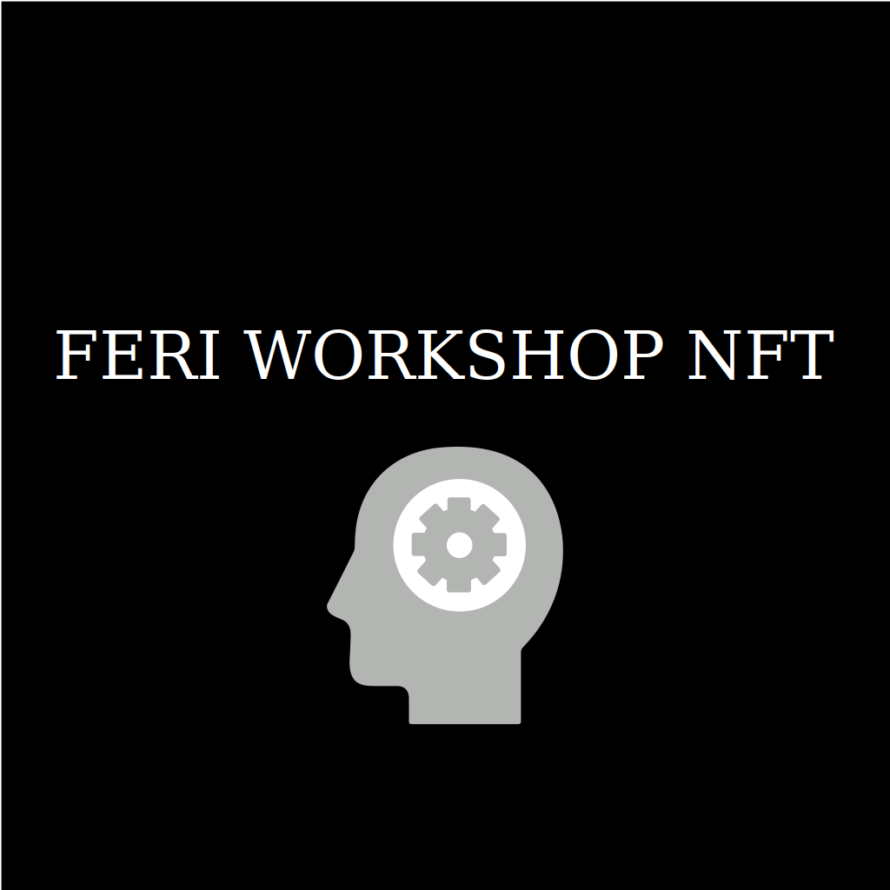

# FERI NFT Project

## 0. Requirements

Metamask wallet with testnet ETH on Rinkeby.

Metamask: https://metamask.io 
Get testnet ETH: https://faucets.chain.link/rinkeby 

## 1. REMIX

IDE for Solidity. Go to https://remix.ethereum.org/ 

5 Views: File Explorer, Solidity Compiler, Deploy and Run View, Stats and Plugins

### 1.1 File Explorer

Comes with 3 default Smart Contracts stored in contracts folder.

### 1.2 Solidity Compiler

User can choose language and version here. We'll be using Solidity 8.0.0. User can also choose EVM (Ethereum Virtual Machine) version. We'll be going with default.
Under configuration check auto compile, which will automatically compile code after every change. We'll be also using option enable optimization.
Once code is compiled user can also copy ABI (human readable version of Bytecode) and Bytecode (code that lives on blockchain).

### 1.3 Deploy and Run

Here users can deploy and test smart contracts. They can be deployed to a local testnet or to a mainnet. Users can also test functions of their smart contracts here.

## 2. Solidity

Solidity is a Smart Contract programming language. It is similar to C++.
Create a new file named 4_NFT.sol in contracts folder and paste following <a href="https://github.com/blockchain-lab-um/feri-nft/blob/main/contracts/0_FirstContract.sol">code</a>.

```
// SPDX-License-Identifier: UNLICENSED

pragma solidity ^0.8.0;

import "hardhat/console.sol";

contract MyFirstSC {
    constructor() {
        console.log("This is my first smart contract!");
    }
}
```

This is your very first Smart Contract. It's a very simple contract that logs some text when initialized. Now, let's go through this simple contract line by line:

`// SPDX-License-Identifier: GPL-3.0`

Just a fancy comment.  It's called an "SPDX license identifier", You can read more about that here (https://spdx.org/licenses/).

`pragma solidity >=0.7.0 <0.9.0;`

Version of solidity we want to use. This line just says we want a version equal or higher than 0.7.0, but lower than 0.9.0

`import "hardhat/console.sol";`

This is how we import contract that allows us to log to console.

```
contract MyFirstSC {
    constructor() {
        console.log("This is my first smart contract!");
    }
}
```

Smart Contracts look like classes from other programming languages. They use word contract instead of class. Once this smart contract is initialized constructor function will run and text will print out in the conosole.

Now that we understand what this smart contract does, let's test it. To do that, go to compiler view. Now press compile button, to compile the smart contract. Then, go to Deploy view and press deploy to deploy it. Note, you should have JavaScript VM (London) selected under Environment. This allows us to test our smart contracts on a local environment, before deploying it on a real blockchain.

Once smart contract is deployed, the text should get logged in logs and just like that, we've deployed our very first smart contract on a local testnet.

## 3. NFT

ERC721 Standard...

<a href="https://github.com/blockchain-lab-um/feri-nft/blob/main/contracts/1_FirstNFT.sol">code</a>
```
pragma solidity ^0.8.0;

// Import OpenZeppelin ERC721 contract and Counter contract
import "@openzeppelin/contracts/token/ERC721/extensions/ERC721URIStorage.sol";
import "@openzeppelin/contracts/utils/Counters.sol";
import "hardhat/console.sol";

// We inherit the contract we imported. This means we'll have access
// to the inherited contract's methods.
contract MyFirstNFT is ERC721URIStorage {
  // Counter allows us to keep track of how many NFTs have been minted and their ids
  using Counters for Counters.Counter;
  Counters.Counter private _tokenIds;

  // We need to pass the name of our NFTs token and its symbol.
  constructor() ERC721 ("FeriNFT", "FERI") {
    console.log("This is my second NFT Smart Contract!");
  }

  // A function used to mint NFTs
  function mintAnNFT() public {
    // Get the current tokenId, this starts at 0.
    uint256 newItemId = _tokenIds.current();

     // Actually mint the NFT to the sender using msg.sender.
    _safeMint(msg.sender, newItemId);

    // Set the NFTs data.
    _setTokenURI(newItemId, "blah");

    // Increment the counter for when the next NFT is minted.
    _tokenIds.increment();
  }
}
```

OpenZeppelin implemented <a href="https://github.com/OpenZeppelin/openzeppelin-contracts/blob/master/contracts/token/ERC721/ERC721.sol">ERC721</a> standard and allows us to use their implementation and build on top of it. This way ERC721 remains standarized and it also means we dont have to write boilerplate code every time. OpenZeppelin Smart contracts are also battle tested and use the best and most secure practices.

Line by Line

…

### 3.1 Off-chain

tokenURI is where the actual NFT data lives and is linked to a JSON file called the metadata. 
```
{
    "name": "FERI NFT",
    "description": "Owned by a smart individual",
    "image": "https://pridi-na-feri.si/imager/images/programi/250/intro-graphics@2x_df8586bb4c14d18f77324f7452f392cd.png"
}
```

Almost every NFT has a name, description and an image linked to it. It can also be customized. You could add additional attributes, however you must match the OpenSea requirements. If you dont your NFT could end up looking broken. It is important that people use same standards. It’d be total chaos if everybody tried to use their own custom standard.

To host JSON files online use this website: https://jsonkeeper.com. Once you click Save, you’ll get a link to the JSON file.

Change _setTokenURI function to:

`_setTokenURI(newItemId, "INSERT_YOUR_JSON_URL_HERE");`

Now, let's deploy our very first NFT on Rinkeby.

1. Set metamask network to rinkeby
2. Set environment in remix to injected web3
3. Select 4_NFT.sol
4. Deploy
5. Confirm in Metamask
6. Use makeNFT function under deployed contracts
7. Confirm in Metamask
8. Use metamask address on testnets.opensea.io to view minted NFTs.

<a href="https://github.com/blockchain-lab-um/feri-nft/blob/main/contracts/2_FinalOffChain.sol">Final code</a>

### 3.2 On-chain

What happens if a server goes down? Then our image link is completely useless and our NFT is lost. If jsonkeeper goes down, then our NFT is completely broken.

Solution for that is storing data “on-chain”. This means that the metadata, along the image is stored in the blockchain, rather than on an external server. Downside of this is higher gas cost as we’re storing more data on chain. Upside is that our NFTs live “forever”.

A common way to store NFTs is using SVG. SVG is an image format, that is using code to build images.

What our NFT will look like on OpenSea after it's deplyed:



```
// Example svg
<svg xmlns="http://www.w3.org/2000/svg" preserveAspectRatio="xMinYMin meet" viewBox="0 0 350 350">
    <style>.base { fill: white; font-family: serif; font-size: 14px; }</style>
    <rect width="100%" height="100%" fill="black" />
    <text x="50%" y="50%" class="base" dominant-baseline="middle" text-anchor="middle">FERI WORKSHOP NFT</text>
</svg>
```

Use this website to display the image and play around: https://www.svgviewer.dev 

We want to convert JSON to base64, which can be used instead of a link to JSON: https://www.utilities-online.info/base64

First encode SVG image.

`data:image/svg+xml;base64,INSERT_YOUR_BASE64_ENCODED_SVG_HERE`

You can find our encoded image [here](assets/encoded-image.txt).

You can test this by pasting it in a new tab.

Now that we have an encoded image we can add this to the JSON instead of a link to the image.

Our JSON looks like this:

```
{
    "name": "FERI WORKSHOP NFT",
    "description": "Owned by a smart FERI WORKSHOP participant.",
    "image": "data:image/svg+xml;base64,PHN2ZyB4bWxucz0iaHR0cDovL3d3dy53My5v..."
}
```

Great, we no longer need an external server to store our image, however this JSON still needs to get stored somewhere.

We repeat the process, except this time we use the whole JSON

`data:application/json;base64,INSERT_YOUR_BASE64_ENCODED_JSON_HERE`

You can find our encoded JSON [here](assets/encoded-json.txt).

Test this by pasting it in a new tab.


Change _setTokenURI function to:

`_setTokenURI(newItemId, "INSERT_YOUR_BASE64_ENCODED_JSON_HERE");`

Then deploy your NFT on rinkeby.

1. Set metamask network to rinkeby
2. Set environment in remix to injected web3
3. Select 4_NFT.sol
4. Deploy
5. Confirm in Metamask
6. Use makeNFT function under deployed contracts
7. Confirm in Metamask
8. Use metamask address on testnets.opensea.io to view minted NFTs.

<a href="https://github.com/blockchain-lab-um/feri-nft/blob/main/contracts/3_FinalOnChain.sol">Final code</a>
